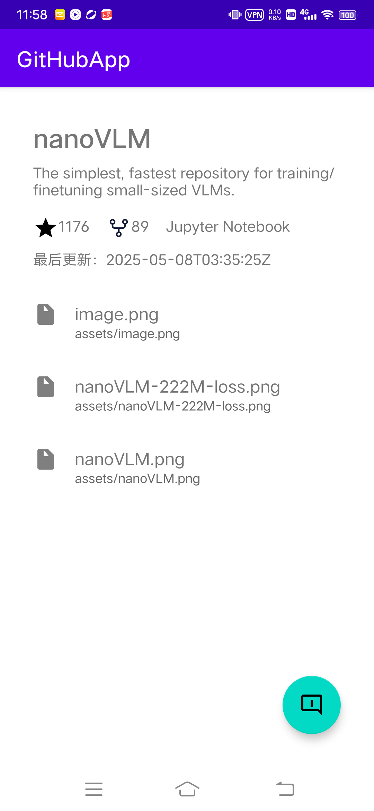

# GitHubApp

Android版GitHub客户端，提供仓库浏览、代码查看、问题提交等功能

## 功能特性

- 最近流行仓库展示（星标/作者/语言）
- 仓库详情查看（README/文件结构）
- 多语言搜索过滤
- 个人信息展示（需要通过OAuth认证）
- 问题反馈功能（登录用户）
- 单元测试覆盖

## 已知问题

- 功能粗糙，界面不够美观
- Trending Topics还未做
- raise issue接口还未调通
- 单元测试只写了2个简单的搜索页面的UI测试case

## 使用介绍

- apk在根目录的apk目录下
- 安装[app-debug.apk](apk/app-debug.apk)即可执行主程序
- 单元测试:[app-debug-androidTest.apk](apk/app-debug-androidTest.apk)
  ，安装主程序apk和单元测试apk后，再执行如下命令即可（目前还需要点一下主程序才可执行）：
  adb shell am instrument -w com.mcdull.githubapp.test/androidx.test.runner.AndroidJUnitRunner
- 单元测试结果
  

## 技术栈

- Kotlin + Jetpack
- MVVM 架构
- Hilt 框架
- Retrofit + OkHttp
- Espresso 单元测试
- GitHub REST API v3

## 部分UML图及数据流图

- 搜索页UML
- 
  
- 
- 搜索页数据流
- 
  
- 个人页UML
- 
  
- 
- 个人页数据流
- 
  

## 截图展示

- 主页
  
- 搜索页
  
- 详情页首页
  
- 详情页子目录页
  
- 个人页已登录
  
- 个人页未登录
  
- OAuth授权界面
  
- 提交问题页
  
- 横屏展示
  
